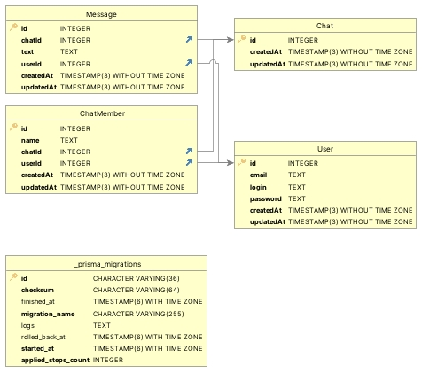

# Chat
(eng/rus)

# Contents
- [In English](#english) 
- [In Russian](#russian)

 

## English  

**Description:**

A simple app for chating

 

**The main features and functionality** of the project include:

&bull; User registration and authorization
 
&bull; Create a chat

&bull; Add and delete chat's members

&bull; Send and receive messages

&bull; Delete messages

 

**Technologies used:** 

    Framework: nest
    Work with databases: prisma, postgress
    Authorization and authentication: jwt, bcript
    Documentation: swagger 
    Other: express-validator, socket-io

**The database**

The database schema consists of 4 tables:

 

## Russian

**Описание:**

Простой чат для обмена сообщениями

 

Основные возможности и функциональность проекта включают в себя:

&bull; Регистрация и авторизация пользователей
 
&bull; Создание чата

&bull; Добавление и удаление пользователей чата

&bull; Отправка и получение сообщений

&bull; Удаление сообщений

 

**Использованые технологии:** 

    Фреймворк: nest
    Работа с базами данных: prisma, postgress
    Авторизация и аутентификация: jwt, bcript
    Документация: swagger 
    Другие: express-validator, socket-io

**База данных**

Схема базы данных состоит из 4 таблиц: 

